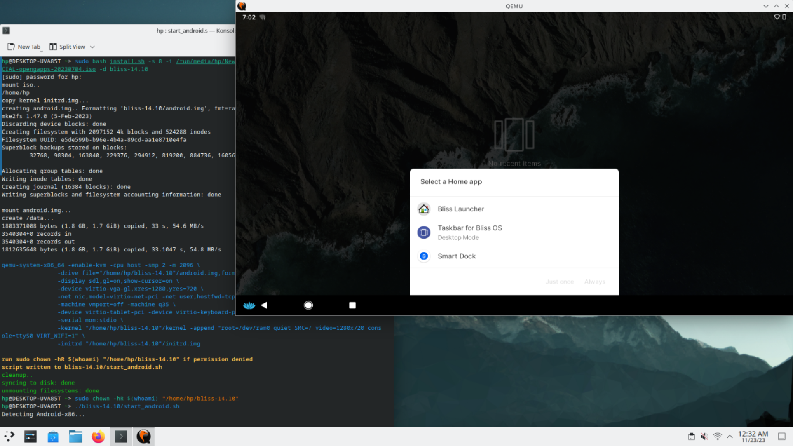

Easily deploy Bliss OS running in QEMU VMs. 
- Bypass bootloader and installer
- Conveniently change kernel parameters.
- Get access to a root shell in the guest using qemu serial console

:::tip[Alternate Installer]
[Android-x86-installer](https://github.com/Xtr126/Android-x86-installer) has a interactive GUI configuration screen for a QEMU install that can run on bare metal and VM simultaneously.
:::

### System requirements
* A Linux x86_64 host with a recent version of QEMU and virglrenderer installed
* Atleast 2GB of available memory to allocate to the VM.
:::caution[Important]
Do not allocate more memory than what is needed to a Android VM. Android thinks unused RAM is wasted RAM and will willingly consume excess memory allocated for caching apps / speeding up the system.  
:::  


### Downloading the script
```bash
curl "https://raw.githubusercontent.com/Xtr126/androidx86-installer-qemu-linux/f7a258b905785f48244fe81d8ffdf7941e0c3520/install.sh" -qgb "" -fLC - --retry 3 --retry-delay 3 -o install.sh
```
As with any other script downloaded from the Internet it is recommended to check what it does before executing.
To initialize a Android x86 VM in specified directory with a disk image of 8 GB, run:  
```bash
sudo bash install.sh -s 8 -i /path/to/BlissOS-v14.iso -d ~/Documents/bliss-14.10
```
Follow the instructions output on stdout by the script.  
The QEMU command to start the VM will be written to `start_android.sh` in the target directory.
:::note
Refer to QEMU advanced configuration section in BlissOS wiki and/or other resources for Audio support and further optimizations/tweaks/settings. 
https://docs.blissos.org/installation/install-in-a-virtual-machine/advanced-qemu-config
:::


## Command line options
```bash
install.sh [-s X] -i android_iso_path -d android_install_dir

Options:
    -i, --isofile (iso)       Android-x86 ISO file
    -d, --destination (path)  Directory to install android files into
    -s, --size (size)         Size in GB (default=8)
        --rw-system           Extract system.img from system.sfs 
        --extract-system      Extract system.img and copy contents
    -h, --help                Display this message and exit
```
