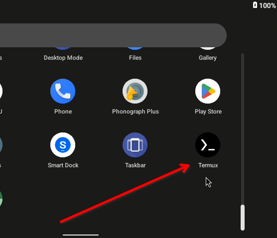

This page describes how to get access to a root shell on Bliss OS for debugging purposes. 

## 1. Open KernelSU from app drawer

## 2. Find Termux in apps list 

:::note
Enable `Show system apps` from the 3-dot menu if Termux is not visible.
:::
### Enable superuser

## 3. Launch Termux from app drawer

### Running commands as root
Type `su` and enter for a root shell.  
Some useful commands available on Bliss OS are listed below:
- `/system_ext/bin/htop` Process viewer
- `/system_ext/bin/nano` Edit text files
- `alsa_mixer` Audio configuration

