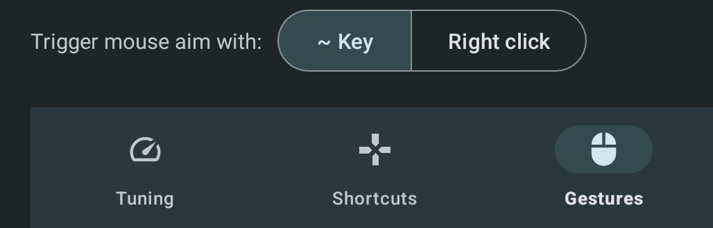

Shooting mode can be activated in three different methods. In XtMapper:
1. Using a shortcut key.
Settings > Shortcuts > Mouse Aim

When shooting mode is activated, mouse left click will be mapped to where the left click is placed in the keymap.   

2. Using ~ key or right click on mouse.
Settings > Gestures > Trigger mouse aim

