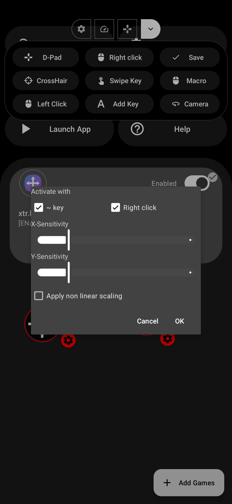

Shooting mode can be activated in two different methods.
#### 1. Using a shortcut key

import { LinkCard } from '@astrojs/starlight/components';

<LinkCard title="Settings > Shortcuts > Mouse Aim" href="../../settings/shortcuts"/>

#### 2. Using `~` key or right click
Click on the gear icon next to the crosshair
:::note[Apply non linear scaling]
When this option is enabled, mouse movement should be decelerated near the screen edges when aiming. This is a workaround for certain games having different pace of camera movement when pointer is near the edges (free fire is known to do this). 
:::

:::note[Left click]
When shooting mode is activated, mouse left click will perform a tap where the left click is placed in the keymap editor.  
:::