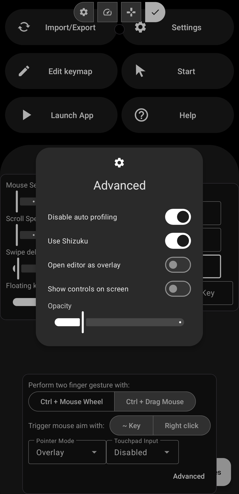

Shooting mode can be activated in two different methods.
#### 1. Using a shortcut key

import { LinkCard } from '@astrojs/starlight/components';

<LinkCard title="Settings > Shortcuts > Mouse Aim" href="../../settings/shortcuts"/>

#### 2. Using `~` key or right click
Settings > Config > Trigger mouse aim

:::note[Left click]
When shooting mode is activated, mouse left click will be mapped to where the left click is placed in the keymap profile.  
:::