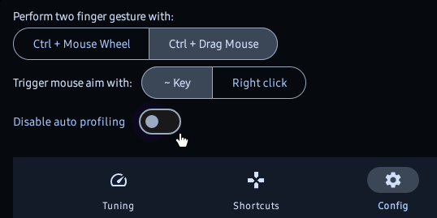

### Disable/Enable
Automatic profile switching can be enabled in settings.

### Top level activity detection
XtMapper will detect what apps are running currently and automatically switch keymapping accordingly.  
The server reads current top level activity and sends it to the client with a 5 second interval.

### Profiles
- Multiple profiles for one app can be configured. 
- User will be prompted to select profile when launching an app if there are multiple profiles. 
- Or a [shortcut](../../settings/shortcuts) can be configured to switch profiles for running applications.
- When a profile is in disabled state, keymapping won't work for that specific application.  

