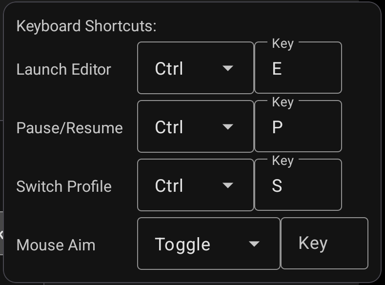

- **Launch editor:** Opens the keymap editor overlay.
- **Pause/Resume:** Stops keymapping temporarily. Revokes exclusive access to mouse devices(evdev).
- **Switch profile:** Choose from a list of available keymap profiles.
- **Mouse aim:** Toggle or hold key to activate [shooting mode](../../features/aiming).