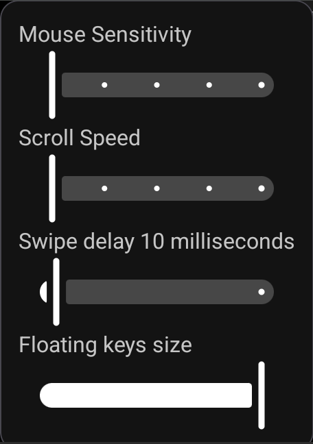

- **Mouse sensitivity:** Adjust the speed of the cursor.  
Changes fast the pointer moves when XtMapper is activated and running.
- **Scroll speed:** When XtMapper is running it smoothens scrolling.   
Adjust this slider to change the scrolling speed.
- **Swide delay:** How fast XtMapper performs touches when using dpad or swipe keys.  
Try this option if your game doesnt react to swipe keys or dpad emulated touch events.
- **Floating keys' size:** Increase or decrease the size of floating keys in keymap editor.