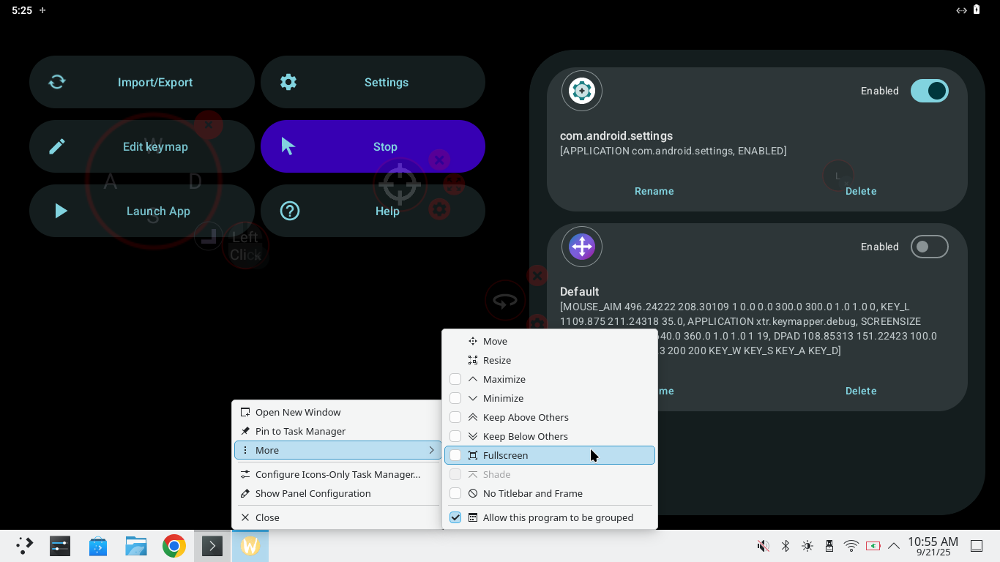

To fullscreen cage-xtmapper, specify the width and height of your display [in the command-line](../4-window-customization) or let cage-xtmapper automatically pick the fullscreen width and height. 
Then, override the window to be fullscreen from your window manager.
## KDE Plasma
Right click the icon on taskbar > More > Fullscreen

